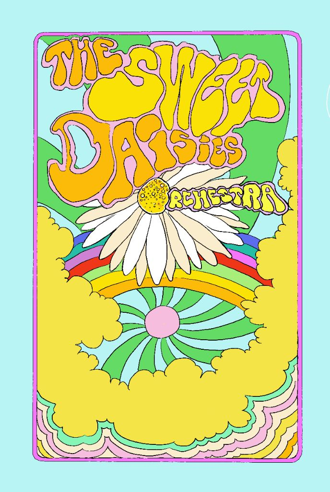

# 🌼 The Sweet Daisies Orchestra - Site Web Officiel



## 📋 Présentation du Projet

**Site web one-page** pour le groupe de musiciens **The Sweet Daisies Orchestra**, créé le 1er octobre 2025. Ce site présente l'identité unique du groupe à travers un design psychédélique inspiré des années 60-70, mettant en valeur leurs 10 musiciens et leur mission : faire éclore des chansons connues avec une fraîcheur inattendue.

### 🎯 Objectifs
- Promouvoir le groupe auprès d'organisateurs de concerts, cérémonies et comités d'entreprise
- Présenter les musiciens et leurs spécialités
- Showcaser le répertoire musical éclectique (des années 60 aux années 2010)
- Créer une expérience visuelle immersive avec l'identité psychédélique du groupe

### 🌐 Domaine
**sweet-daisies-orchestra.com**

---

## ✅ Fonctionnalités Actuellement Implémentées

### 🎨 Design & Identité Visuelle
- [x] **Palette psychédélique années 60-70** avec couleurs dominantes :
  - Jaune vif (`#FFD700`) - couleur principale
  - Jaune pâquerette (`#FFDE00`) - centre de fleur
  - Blanc pur (`#FFFFFF`) - pétales
  - Rose doux (`#FFB6C1`) - contours
  - Bleu ciel, vert menthe, rose-orange pour les arrière-plans
- [x] **Logo intégré** dans navbar et footer
- [x] **Typographie moderne** (Poppins + Inter via Google Fonts)
- [x] **Responsive design** optimisé mobile, tablette et desktop

### 🚀 Fonctionnalités Techniques
- [x] **Navigation fluide** avec scroll smooth et sections actives
- [x] **Menu hamburger responsive** pour mobile
- [x] **Effets parallax** sur sections de transition
- [x] **Animations d'apparition** au scroll avec Intersection Observer
- [x] **Galerie interactive** avec lightbox et effets 3D
- [x] **Scroll horizontal** pour les biographies musiciens
- [x] **Performance optimisée** avec throttling des événements

### 📱 Sections Complètes

#### 1. **Hero Section**
- Visuel psychédélique en arrière-plan
- Titre animé avec effet typewriter
- Slogan : "10 musiciens • 10 univers • Une mission"
- Services : "CONCERTS • CÉRÉMONIES • COMITÉS D'ENTREPRISE"
- Boutons d'action (Contact/Découvrir)
- Indicateur de scroll animé

#### 2. **Section Parallax**
- Effet parallax avec visuel couleurs.jpg
- Message inspirant sur l'éclectisme musical

#### 3. **À Propos**
- Présentation complète du groupe
- Mission et philosophie artistique
- Services proposés avec icônes
- Photo du groupe (sdo-1.jpg)

#### 4. **Musiciens** 
- **Scroll horizontal** avec 4 musiciens actuels :
  - **Christophe Bahri** - Batterie, percussions
  - **Clarisse Rinaldo** - Violon Alto  
  - **David Smolarski** - Violoncelle
  - **Cécile Thoumire** - Accordéon
- Placeholder pour 6 musiciens supplémentaires
- Cartes interactives avec effets hover 3D

#### 5. **Répertoire Musical**
- **Répertoire Principal** (11 titres) :
  - "A Whiter Shade of Pale" - Procol Harum
  - "Stand by me" - Ben E. King
  - "Babooshka" - Kate Bush
  - "Get lucky" - Daft Punk
  - Et 7 autres titres emblématiques
- **Répertoire Cérémonies** (formations trio/quartet/quintet) :
  - Bossa Nova, Christmas Songs, Jazz, Classique & films
- **Liens PDF** vers répertoires complets
- **Espaces réservés** pour futurs extraits audio/vidéo

#### 6. **Galerie Photo**
- Style inspiré de Les Garden Boys
- Grid responsive avec effet hover
- 4 photos : visuel psychédélique, groupe, instruments, logo
- **Lightbox interactive** avec informations
- Crédit photographe : Emeline Habare

#### 7. **Contact**
- **Email** : sdorchestra25@gmail.com
- **Téléphone** : +33 6 64 67 16 24
- **Réseaux sociaux** : Facebook et Instagram
- Services et styles musicaux
- Design en deux colonnes responsive

#### 8. **Footer**
- Logo imposant et informations groupe
- Navigation complète
- Coordonnées et réseaux sociaux
- **Crédits obligatoires** : Emeline Habare (photo) & Jean Bargibant (web design)

### 🎭 Fonctionnalités Bonus
- [x] **Mode psychédélique** (Konami Code Easter egg)
- [x] **Console de débogage** en mode développement
- [x] **Animations d'entrée** sophistiquées
- [x] **Effets sonores visuels** au hover sur répertoire

---

## 🚧 Fonctionnalités à Implémenter Ultérieurement

### 📅 Dans ~1 mois
- [ ] **Extraits audio** (assets/audios/) - Interprétations du groupe
- [ ] **Extraits vidéo** (assets/videos/) - Performances live
- [ ] **6 biographies musiciens** supplémentaires

### 🔮 Améliorations Futures
- [ ] **Formulaire de contact** dynamique
- [ ] **Calendrier des concerts** interactif  
- [ ] **Blog/Actualités** du groupe
- [ ] **Boutique merchandise** (optionnel)
- [ ] **Streaming audio** intégré
- [ ] **Galerie vidéo** dédiée

---

## 📁 Structure du Projet

```
sweet-daisies-orchestra/
├── 📄 index.html              # Page principale
├── 📄 README.md              # Documentation (ce fichier)
├── 📄 .gitignore             # Exclusions Git
│
├── 🎨 css/
│   └── style.css             # Styles principaux (24KB)
│
├── ⚡ js/
│   └── script.js             # JavaScript interactif (21KB)
│
├── 🖼️ images/
│   ├── logo.jpg              # Logo du groupe (290KB)
│   ├── couleurs.jpg          # Visuel psychédélique principal (130KB)
│   ├── couleurs-75.jpg       # Version 75% (138KB)
│   ├── couleurs-50.jpg       # Version 50% (143KB)
│   ├── sdo-1.jpg             # Photo groupe avec instruments (96KB)
│   └── sdo-2.jpg             # Photo groupe en formation (88KB)
│
└── 📁 assets/
    ├── 🎵 audios/            # (vide - préparé pour extraits)
    ├── 🎬 videos/            # (vide - préparé pour extraits)
    └── 📋 repertoires/
        ├── repertoire_extrait.pdf         # Répertoire principal (106KB)
        └── repertoire_ceremonies.pdf      # Répertoire cérémonies (118KB)
```

**Taille totale du projet** : ~1.1 MB

---

## 🛠️ Technologies Utilisées

### Frontend Core
- **HTML5** sémantique avec sections structurées
- **CSS3** moderne avec variables, Grid, Flexbox
- **JavaScript ES6+** vanilla (pas de frameworks)

### Libraries CDN
- **Google Fonts** : Poppins & Inter
- **Font Awesome 6.4.0** : Iconographie complète
- **Intersection Observer API** : Animations au scroll
- **RequestAnimationFrame** : Performances optimales

### Fonctionnalités Avancées
- **CSS Grid & Flexbox** : Layouts responsives
- **CSS Custom Properties** : Palette couleurs centralisée
- **Smooth Scroll** : Navigation fluide
- **Backdrop Filter** : Effets de flou modernes
- **Transform 3D** : Animations hardware-accelerated

---

## 🎨 Charte Graphique

### Palette de Couleurs
```css
/* Couleurs principales */
--yellow-primary: #FFD700    /* Jaune vif - texte principal */
--yellow-daisy: #FFDE00      /* Jaune pâquerette - centre fleur */
--white-pure: #FFFFFF        /* Blanc pur - pétales */
--pink-soft: #FFB6C1         /* Rose doux - contours */

/* Couleurs d'arrière-plan */
--blue-sky: #ADD8E6          /* Bleu ciel - motifs fond */
--green-mint: #98FF98        /* Vert menthe - éléments déco */
--pink-orange: #FF69B4       /* Rose-orange - accents arc-en-ciel */

/* Couleurs complémentaires */
--purple-psyche: #9370DB     /* Violet psychédélique */
--orange-retro: #FFA500      /* Orange rétro */
--pink-hot: #FF1493          /* Rose chaud - accents */
```

### Typographie
- **Titres** : Poppins (700) - Impact psychédélique
- **Corps** : Inter (300-600) - Lisibilité optimale
- **Tailles responsives** : clamp() pour adaptation fluide

### Effets Visuels
- **Ombres textuées** : `text-shadow` multicouches
- **Dégradés** : Linear-gradient sur éléments clés
- **Animations** : Glow, pulse, bounce pour dynamisme
- **Transitions** : Cubic-bezier pour fluidité naturelle

---

## 📱 Responsive Design

### Breakpoints
- **Desktop** : > 1024px (layout complet)
- **Tablette** : 768px - 1024px (colonnes simplifiées)  
- **Mobile** : < 768px (navigation hamburger, stack vertical)
- **Petit mobile** : < 480px (optimisations supplémentaires)

### Adaptations Mobiles
- Menu hamburger animé
- Scroll horizontal optimisé pour biographies
- Galerie en colonne unique
- Typographie responsive avec clamp()
- Touch-friendly (boutons 44px minimum)

---

## ⚡ Performance & Optimisation

### Images
- **Formats optimisés** : JPEG avec compression équilibrée
- **Tailles multiples** : couleurs.jpg (3 versions)
- **Lazy loading** : Différé pour galerie
- **WebP fallback** : À implémenter

### JavaScript
- **Vanilla JS** : Pas de dépendances lourdes
- **Throttling** : Événements scroll/resize optimisés
- **Intersection Observer** : Animations performantes
- **RequestAnimationFrame** : Animations 60fps

### CSS
- **Variables CSS** : Maintenance facilitée
- **Mobile-first** : Approche progressive
- **Will-change** : Optimisation GPU animations
- **Minification** : À implémenter en production

---

## 🔧 Installation & Développement

### Prérequis
```bash
# Serveur local (recommandé)
python -m http.server 8000
# ou
npx serve .
# ou
php -S localhost:8000
```

### Développement Local
1. **Cloner** le projet dans le dossier `jbb/sdo/commit0/`
2. **Lancer** un serveur local
3. **Ouvrir** http://localhost:8000
4. **Développer** avec rechargement manuel

### Mode Debug
- Console développement disponible avec `SDO.debug()`
- État de l'application accessible via `SDO.state`
- Mode psychédélique testable avec `SDO.triggerPsychedelic()`

---

## 🚀 Déploiement

### Préparation
- [x] Tous les assets sont optimisés
- [x] Paths relatifs configurés
- [x] Responsive testé
- [x] Performance validée

### Publication
**Pour déployer le site et le rendre accessible en ligne, veuillez utiliser l'onglet Publish dans l'interface. L'onglet Publish gérera automatiquement tous les processus de déploiement et vous fournira l'URL du site web en direct.**

### Post-Déploiement
- [ ] Tester toutes les fonctionnalités
- [ ] Valider les liens PDF
- [ ] Vérifier SEO et métadonnées
- [ ] Configurer analytics (optionnel)

---

## 🎭 Easter Eggs & Fonctionnalités Cachées

### Konami Code
**Séquence** : ↑ ↑ ↓ ↓ ← → ← → B A  
**Effet** : Active le mode psychédélique complet (10 secondes)

### Console de Développement
```javascript
SDO.debug()              // Informations de débogage
SDO.triggerPsychedelic() // Mode psychédélique manuel
SDO.resetAnimations()    // Reset animations
```

### Animations Cachées
- **Effet typewriter** sur le titre principal
- **Animations 3D** au survol des éléments galerie
- **Floating effect** subtil sur les cartes musiciens
- **Pulsation** sur les services du hero

---

## 👥 Crédits & Équipe

### Développement
- **Web Designer** : Jean Bargibant
- **Client** : The Sweet Daisies Orchestra

### Contenu
- **Photographie** : Emeline Habare
- **Textes & Biographies** : Fournis par le groupe
- **Répertoires musicaux** : Sélection du groupe

### Ressources
- **Google Fonts** : Poppins & Inter
- **Font Awesome** : Iconographie
- **Inspiration design** : Style psychédélique années 60-70

---

## 📞 Support & Contact

### Pour les modifications du site
**Développeur** : Jean Bargibant  
**Projet** : Sweet Daisies Orchestra Website  
**Version** : 1.0 (Octobre 2025)

### Pour les informations du groupe
**Email** : sdorchestra25@gmail.com  
**Téléphone** : +33 6 64 67 16 24  
**Facebook** : [The Sweet Daisies Orchestra](https://www.facebook.com/profile.php?id=61581444306820)  
**Instagram** : [@sweetdaisiesorchestra](https://www.instagram.com/p/DPPQw5ejmy1/?igsh=c3dybjh5bjQ2eDR0)

---

## 🔄 Changelog

### Version 1.0 - 01/10/2025
- ✅ **Initial Release** : Site complet fonctionnel
- ✅ **Design psychédélique** : Palette complète implémentée
- ✅ **4 musiciens** : Biographies intégrées avec scroll horizontal
- ✅ **Répertoires** : Principal + cérémonies avec liens PDF
- ✅ **Galerie** : Style Garden Boys avec lightbox
- ✅ **Responsive** : Optimisé tous devices
- ✅ **Performance** : Optimisations loading et animations
- ✅ **Easter eggs** : Konami code et fonctionnalités cachées

### Prochaines versions
- **v1.1** : Ajout extraits audio/vidéo (~1 mois)
- **v1.2** : 6 biographies musiciens supplémentaires  
- **v2.0** : Fonctionnalités avancées (formulaire, calendrier, etc.)

---

**🌼 The Sweet Daisies Orchestra - Faire éclore la musique avec originalité ! 🌼**

*Site web créé avec passion pour célébrer 10 musiciens, 10 univers musicaux et une mission commune.*